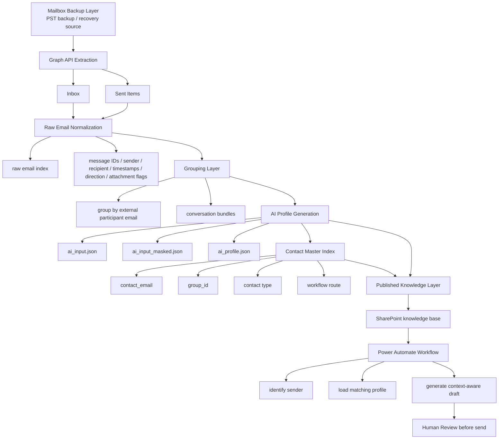

## 🌸 Overview
This project is an AI-assisted email memory and draft generation workflow designed to turn historical mailbox data into reusable contact knowledge.
The system extracts structured email records from Microsoft Graph, groups messages by external participant, builds AI-generated contact profiles from historical conversations, and uses those profiles to support context-aware draft replies inside an automation workflow.
The goal is not full auto-send, but faster, more consistent, and better-informed draft generation with human review in the loop.

## Design principle
Local pipeline = source of truth
SharePoint = published runtime knowledge base
Power Automate = live draft generation layer

## Core workflow 
- Mailbox backup layer
Keep a full mailbox backup as the raw archive and recovery source.

- Graph API extraction layer
Export structured email data from Microsoft Graph, mainly from:
Inbox
Sent Items

- Raw email normalization
Convert exported messages into a consistent raw email index with fields such as sender, recipients, subject, body, timestamps, direction, and message IDs.

- Grouping layer
Group emails by external participant email, so that each contact has a conversation bundle.

- AI profile generation layer
Use historical emails from each group to generate a structured ai_profile.json.

- Published knowledge layer
Push selected profiles to SharePoint for workflow usage.

- Draft generation layer
When a new email arrives, the workflow checks whether the sender already exists, loads the corresponding profile, and generates a context-aware draft reply.

---

